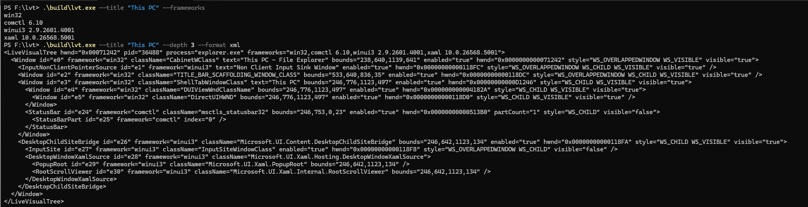
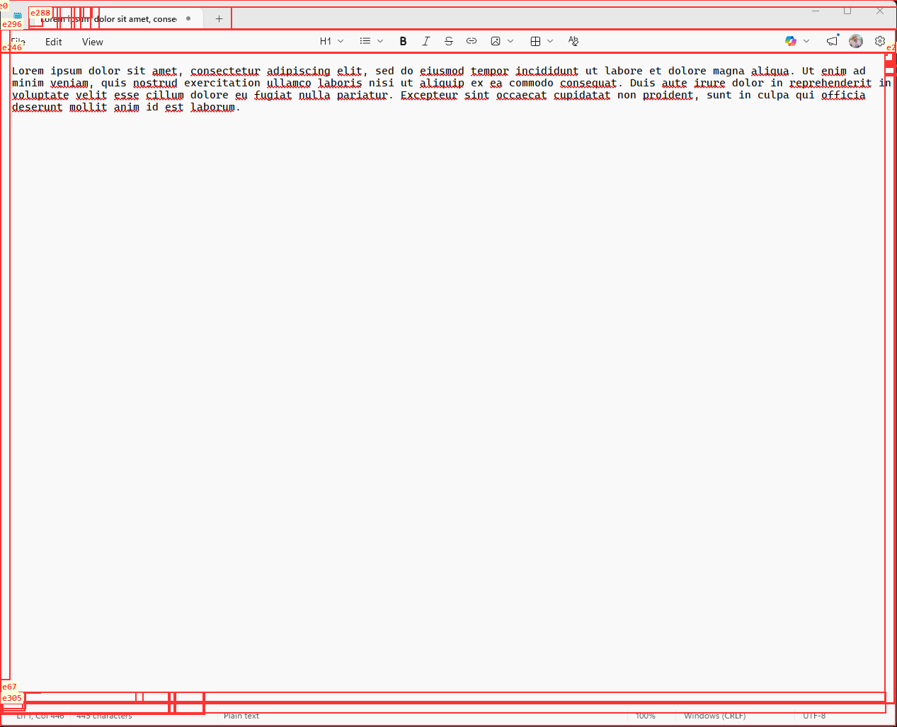

# lvt — Live Visual Tree

A Windows CLI tool that inspects the visual tree of running applications. Designed for AI agents (e.g. GitHub Copilot) that need a textual representation of an app's UI content.





## What it does

- Targets any running Windows app by HWND, PID, process name, or window title
- Detects UI frameworks in use: Win32, ComCtl, Windows XAML (UWP), WinUI 3, WPF, [Avalonia](docs/avalonia-plugin.md), [Chrome/Edge](docs/chromium-plugin.md)
- Outputs a unified element tree as JSON or XML markup
- Optionally emits the app's [UI Automation tree](#ui-automation-tree---uia) instead, with `AutomationId`s, control types and supported patterns
- Drives applications: click, type, toggle, set values, scroll — through UI Automation patterns where possible
- Runs as an [MCP server](docs/mcp-server.md) (`lvt mcp`), so agents can inspect and operate Windows apps as a computer-use tool
- Captures annotated PNG screenshots with element IDs overlaid
- Elements get stable IDs (`e0`, `e1`, …) so AI agents can reference specific parts of the UI

## Quick start

### Download

Grab the latest release from **[GitHub Releases](https://github.com/asklar/lvt/releases/latest)** — extract the zip and run `lvt.exe` from any terminal.

### Install the Copilot skill

The easiest way to add the lvt skill to GitHub Copilot CLI is to install it as a plugin:

```
/plugin install asklar/lvt
```

This gives Copilot the ability to inspect any running Windows app's UI when you ask it to. Verify with `/skills list`.

### Build from source

#### Prerequisites

- Visual Studio 2022+ (C++ Desktop workload)
- [vcpkg](https://vcpkg.io) with `VCPKG_ROOT` environment variable set
- CMake 3.20+
- x64 Developer Command Prompt
- [Rust](https://rustup.rs) — only for the MCP server, which is off by default

#### Build

```powershell
# x64 build (default)
cmake --preset default
cmake --build build

# ARM64 build
cmake --preset arm64
cmake --build build-arm64

# With the MCP server (needs a Rust toolchain)
cmake --preset default -DLVT_ENABLE_MCP=ON
cmake --build build
```

Produces `build/lvt.exe` and `build/lvt_tap_x64.dll` (or `build-arm64/lvt.exe` and `build-arm64/lvt_tap_arm64.dll` for ARM64).

> **Note:** lvt.exe must match the target process's architecture. If you target an ARM64 app, use the ARM64 build. A clear error message is shown on mismatch.

#### Build options

Framework support is per-provider, so you can drop pieces you don't need. Win32 and ComCtl are always built — every other provider enriches that base layer.

| Option | Default | Effect |
| --- | --- | --- |
| `LVT_ENABLE_XAML` | ON | System XAML (UWP / DesktopWindowXamlSource) |
| `LVT_ENABLE_WINUI3` | ON | WinUI 3 (Windows App SDK) |
| `LVT_ENABLE_WPF` | ON | WPF |
| `LVT_ENABLE_WINFORMS` | ON | WinForms |
| `LVT_ENABLE_AVALONIA` | ON | Avalonia plugin |
| `LVT_ENABLE_CHROMIUM` | ON | Chromium (Chrome/Edge DOM) plugin |
| `LVT_BUILD_TOOL` | ON | Build the `lvt` CLI as well as the library |
| `LVT_BUILD_MANAGED` | ON | Build the managed .NET helper assemblies |
| `LVT_BUILD_TESTS` | ON | Build the test executables |

`LVT_BUILD_MANAGED` is the only thing that requires the .NET SDK. WPF, WinForms and Avalonia each have a native half that hosts the CLR plus a managed tree-walker assembly; only the latter needs `dotnet`. With `-DLVT_BUILD_MANAGED=OFF` the whole native build still works, including those TAP DLLs — you just lose managed enrichment for those three frameworks. XAML and WinUI 3 are pure C++ either way.

#### C++/WinRT projection

The XAML and WinUI 3 providers need C++/WinRT headers. These come from two places:

- `winrt/base.h` and the `Windows.*` projection — from the **`cppwinrt` vcpkg port**
- the `Microsoft.*` (WinUI 3) projection — generated at configure time into `src/tap/winui3/` from the **Windows App SDK NuGet package**, which has no vcpkg port

Both halves must be produced by the same cppwinrt version, or the generated headers fail to compile against `base.h`'s macros ("Mismatched C++/WinRT headers"). Taking the generator from the `cppwinrt` port rather than the Windows SDK keeps them in lockstep — and because vcpkg installs only one version of a port per triplet, a consumer that already depends on `cppwinrt` picks the version for both.

The generated projection is cached in `src/tap/winui3/` (gitignored) and regenerated whenever the generator or the Windows App SDK inputs change, tracked via `src/tap/winui3/.cppwinrt-signature`. Two escape hatches:

```powershell
# Use a specific generator or Windows App SDK package
cmake --preset default -DLVT_CPPWINRT_EXE=... -DLVT_WASDK_WINMD_DIR=...

# Force a full regeneration
Remove-Item -Recurse src/tap/winui3
```

## Using lvt from another project

lvt installs a CMake package exposing `lvt::core`, the same library the CLI is built on.

### With vcpkg

This repository doubles as a [vcpkg registry](https://learn.microsoft.com/vcpkg/consume/git-registries). Add a `vcpkg-configuration.json` next to your `vcpkg.json`:

```json
{
  "default-registry": {
    "kind": "git",
    "repository": "https://github.com/microsoft/vcpkg",
    "baseline": "<a microsoft/vcpkg commit sha>"
  },
  "registries": [
    {
      "kind": "git",
      "repository": "https://github.com/asklar/lvt",
      "baseline": "<an asklar/lvt commit sha>",
      "packages": [ "lvt" ]
    }
  ]
}
```

then depend on it from your `vcpkg.json`:

```json
{
  "dependencies": [
    { "name": "lvt", "features": [ "winui3", "wpf" ] }
  ]
}
```

Features map one-to-one onto the framework options above: `xaml`, `winui3`, `wpf`, `winforms`, `avalonia`, `chromium`, plus `tools` for the CLI. All but `avalonia` are on by default. The port always builds with `LVT_BUILD_MANAGED=OFF`, because vcpkg builds have neither network access nor a .NET SDK — see [`ports/lvt/usage`](ports/lvt/usage).

### In CMake

```cmake
find_package(lvt CONFIG REQUIRED)
target_link_libraries(my_app PRIVATE lvt::core)

# lvt looks for its injectable TAP DLLs next to the binary it is linked into,
# so copy them beside your executable:
lvt_copy_tap_dlls(my_app)
```

```cpp
#include <lvt/target.h>
#include <lvt/framework_detector.h>
#include <lvt/tree_builder.h>
#include <lvt/json_serializer.h>
#include <lvt/lvt_config.h>   // which frameworks were compiled in

auto matches    = lvt::find_by_process_name("notepad");
auto target     = lvt::resolve_target(matches[0].hwnd, matches[0].pid);
auto frameworks = lvt::detect_frameworks(target.hwnd, target.pid);
auto tree       = lvt::build_tree(target.hwnd, target.pid, frameworks);
lvt::assign_element_ids(tree);
```

Instead of `lvt_copy_tap_dlls()` you can call `lvt::set_tap_directory()` at runtime, or point the `LVT_TAP_DIR` environment variable at the installed tools directory. Plugins are searched for in `$LVT_PLUGIN_DIR`, then `<module dir>/plugins`, then `%USERPROFILE%\.lvt\plugins`.

### Usage

lvt takes a verb, then arguments, then options. The verb defaults to `dump`.

```bash
# Dump Notepad's visual tree as JSON (dump is implied)
lvt --name notepad

# XML output
lvt dump --name notepad --format xml

# Capture annotated screenshot
lvt screenshot --pid 1234 --output out.png

# Just detect frameworks
lvt frameworks --hwnd 0x1A0B3C

# Scope to a subtree
lvt dump --name myapp --element e5 --depth 3

# Query an element by durable key or eN id
lvt query "win32|MyWindow/win32|Button|Name:OK" text --name myapp

# Watch for live tree changes as JSON diff events
lvt watch --name notepad --interval 250
```

Driving an app is the same shape — see [Interaction](#interaction) for the full list:

```bash
lvt click e6 --name myapp
lvt set-value e4 "hello" --name myapp
lvt wait-for e9 --wait-prop IsEnabled=true --name myapp
```

### Verbs

| Verb | Description |
|------|-------------|
| `dump` | Output the element tree (default when no verb is given) |
| `screenshot` | Capture an annotated PNG to `--output` |
| `frameworks` | List the UI frameworks the target uses |
| `watch` | Emit live JSON tree diff events until Ctrl+C |
| `query <ref> [prop]` | Output one element, or one of its properties |
| `mcp` | Serve the [Model Context Protocol](docs/mcp-server.md) over stdio |

### Options

| Flag | Description |
|------|-------------|
| `--hwnd <handle>` | Target window by HWND (hex) |
| `--pid <pid>` | Target process by PID |
| `--name <exe>` | Target by process name (e.g. `notepad` or `notepad.exe`) |
| `--title <text>` | Target by window title substring |
| `--output <file>` | Write to a file instead of stdout, or the PNG path for `screenshot` |
| `--format <fmt>` | `json` (default) or `xml` |
| `--interval <ms>` | Polling interval for `watch` (default: 500) |
| `--fast` | Skip the XAML/WinUI3 property-chain walk (`GetPropertyValuesChain`) in favor of cheap direct property reads. Much faster on a rich tree — still reports bounds, `Text`, `Content`, and basic state, but not arbitrary custom properties. Default is off (today's exhaustive collection) |
| `--element <ref>` | Scope to a specific element subtree by positional `eN` id, durable key, or `uia:<RuntimeId>` |
| `--uia` | Use the UI Automation tree instead of the visual tree |
| `--uia-view <view>` | UIA tree view: `control` (default), `raw`, or `content` |
| `--uia-props <list>` | Comma-separated extra UIA properties to include |
| `--uia-timeout <ms>` | Walk deadline (default: 10000). Caps how long UIA waits for any single provider response, and the traversal itself; a truncated tree is marked with a `Truncated` property on its root. `0` removes lvt's deadline, leaving UIA's own 20s default |
| `--depth <n>` | Max tree traversal depth |

> **Upgrading from 0.2.x:** `--dump`, `--screenshot`, `--frameworks`, `--watch` and
> `--query` are now verbs. Running the old flag prints the replacement. Target and
> output flags are unchanged, and `lvt --name notepad` still dumps the tree.

## UI Automation tree (`--uia`)

The visual tree answers *"what is this UI made of?"*. `--uia` answers *"how do I
drive it?"* — it emits the target's UI Automation tree, so every element carries
the identifiers an automation client needs:

```powershell
# Automation-grade view of an app
lvt dump --uia --name myapp

# Everything UIA can see, including framework scaffolding
lvt dump --uia --uia-view raw --name myapp

# Add properties that are not in the default set
lvt dump --uia --uia-props ProviderDescription,IsPassword --name myapp

# Address an element by its UIA RuntimeId
lvt query uia:42.3150138.4.5 AutomationId --name myapp
```

Elements report `AutomationId`, `ControlType`, `LocalizedControlType`,
`FrameworkId`, `RuntimeId`, interaction state (`IsEnabled`, `IsOffscreen`,
`HasKeyboardFocus`, …), the `SupportedPatterns` list, and the state belonging to
those patterns (`Value.Value`, `Toggle.ToggleState`, `ExpandCollapse.State`,
`RangeValue.*`, `Scroll.*`, …).

Pattern-backed properties are **only emitted where the pattern is supported**.
UIA will otherwise tell you a `Window`'s `Toggle.ToggleState` is
`Indeterminate` — not because it has one, but because `GetCachedPropertyValue`
substitutes the type's default for unsupported properties. lvt reads them with
`ignoreDefaultValue` so UIA reports "not supported" instead, and a `Button`
shows `SupportedPatterns="Invoke,…"` with no toggle state while a `CheckBox`
shows `Toggle.ToggleState="On"`.

Everything that works on the visual tree works here: `eN` ids, durable keys,
`--element`, `--query`, `--depth`, `--watch`, `--format xml`, and annotated
screenshots.

### Works across architectures

`--uia` injects nothing into the target, so unlike the visual-tree providers it
is not restricted to processes matching lvt's own architecture:

```powershell
# x64 lvt.exe reading a 32-bit process — refused for the visual tree, fine for UIA
lvt dump --uia --pid 51748
```

### Relationship to the visual tree

The visual tree remains the default and is unchanged by this: it is built from
framework-native APIs and never depends on UIA. `--uia` **replaces** it for that
invocation rather than enriching it — the two are separate views of the same
window. Reach for the visual tree for framework-native structure and internals,
and `--uia` when you need automation identity and actionable state.

## Interaction

lvt can also *drive* an app. Every interaction verb implies `--uia`, because
element references are resolved against a UIA walk and acting needs the patterns
only that view exposes.

```bash
lvt click e6 --name myapp                 # Invoke, else default action, else a real click
lvt toggle e7 --name myapp                # flip a checkbox
lvt set-value e4 "hello" --name myapp     # text, or a numeric slider/spinner value
lvt press-key "Ctrl+S" --name myapp       # or "Enter;Tab" for a sequence
lvt wait-for e9 --wait-prop IsEnabled=true --name myapp
```

| Verb | Pattern used | Falls back to |
|------|--------------|---------------|
| `click <ref>` | `Invoke`, then `LegacyIAccessible.DoDefaultAction` | synthetic click |
| `right-click <ref>` / `double-click <ref>` | — | always synthetic |
| `invoke <ref>` | `Invoke` only | nothing; fails instead |
| `toggle <ref>` | `Toggle` | — |
| `set-value <ref> <text>` | `Value`, then `RangeValue` for numbers | focus + select-all + type |
| `expand` / `collapse <ref>` | `ExpandCollapse` | — |
| `select <ref>` | `SelectionItem.Select` | — |
| `add-to-selection` / `remove-from-selection <ref>` | `SelectionItem` | — |
| `select-text <ref> [text]` | `Text.FindText` + `Select` | — |
| `focus <ref>` | `SetFocus` | — |
| `scroll <ref> <dir>` | `Scroll`, then `ScrollItem.ScrollIntoView` | mouse wheel |
| `type <text>` | — | synthetic; `--focus-first <ref>` to target |
| `press-key <chord>` | — | synthetic |
| `close` / `minimize` / `maximize` / `restore [<ref>]` | `Window` | — |
| `wait-for` / `wait-gone <ref>` | polls a walk | — |

**Pattern first, input second.** A UIA pattern does not steal focus, does not move
the cursor, and works when the window is not on top. Synthetic input does all
three, so it is only used when nothing else will do the job. The result JSON
reports which was used:

```json
{ "action": "click", "ok": true, "method": "InvokePattern",
  "result": { "AutomationId": "PrimaryButton", ... } }
```

`result` is the element *after* the action, so you can confirm the effect without
a second walk. On failure, `error` says whether the pattern was missing or present
but refused.

**Virtualized items** are realized automatically — an item in a long list does not
exist as an element until then, and `method` reports `VirtualizedItem.Realize+…`
when that happened.

**Waiting.** `wait-for` blocks until an element appears, or with `--wait-prop
<name>=<value>` until it reports that value; `wait-gone` waits for it to
disappear. Both stop at `--wait-timeout` (default 5000 ms) and exit non-zero on
timeout, so a script can branch on it.

**Repeating an action** is just repeating the command — there is no repeat count,
since only the OS-interpreted sequences (double-click, key chords) need precise
timing, and those are their own verbs.

**Choosing a reference.** `eN` is positional and `uia:<RuntimeId>` is tied to the
element's current host window, so both can break when the UI changes *shape* —
not merely its values. Expanding a combo box, for instance, reparents it into a
popup: its `eN` moves and its `RuntimeId` changes, while its durable key does
not. Use `eN` for one-shot commands against a static UI, and the **durable key**
for anything that acts across a structural change.

## MCP server

`lvt mcp` serves the [Model Context Protocol](https://modelcontextprotocol.io)
over stdio, so an agent can inspect and drive Windows applications through the
same machinery the CLI uses — making lvt a general-purpose computer-use tool for
Windows. It is served by `lvt.exe` itself; there is no second binary and no
daemon.

```powershell
lvt mcp                  # inspection only
lvt mcp --allow-input    # also expose the tools that change the target app
```

```json
{
  "mcpServers": {
    "lvt": { "command": "C:\\tools\\lvt\\lvt.exe", "args": ["mcp", "--allow-input"] }
  }
}
```

An agent calls `connect` to open a session on a window, then `get_uia_tree` or
`find_elements` to get element ids, then acts on them with `click`, `set_value`,
`toggle` and the rest. `hit_test` turns a screen coordinate into an element, and
`screenshot` returns an annotated PNG inline.

A session declares which tree it speaks. The default, `mode: "uia"`, drives
controls through their UI Automation patterns — no cursor movement, no focus
stealing, and it works across architectures. `mode: "visual"` drives the
framework-native tree instead, aiming real clicks and keystrokes at where an
element is, which is what custom-drawn UIs need. A session only accepts
references from its own tree and refuses the other's rather than guessing, so
hold one session of each if you need both.

Results come back as `structuredContent` as well as text, every tool declares an
`outputSchema`, and tools are annotated read-only or destructive so a host can
decide what to confirm.

Without `--allow-input` the mutating tools are not registered at all, so a model
cannot be talked into using one. See **[docs/mcp-server.md](docs/mcp-server.md)**
for the full tool reference and the security model.

Building it from source needs a Rust toolchain and is opt-in
(`-DLVT_ENABLE_MCP=ON`); released binaries have it built in.

## lvt Viewer

A graphical, live element-tree browser for Windows — think Visual Studio's
Live Visual Tree or the Windows SDK's Inspect.exe. Drag a crosshair onto a
window to target it; a tree on one side and a property panel on the other
both update live as the target's UI changes.

```powershell
cmake --preset default -DLVT_BUILD_VIEWER=ON
cmake --build build
.\build\viewer\LvtViewer.exe
```

It's a separate WPF (.NET) app that drives `lvt.exe` as a subprocess (`watch`
for live updates, `toggle`/`set-value` for editing) rather than linking
`lvt_core`. See **[src/viewer/README.md](src/viewer/README.md)** for the
architecture, why `watch` was chosen over MCP for live updates, and how to
build/run it.

## Output format

### Watch mode

`--watch` repeatedly rebuilds the target tree and writes newline-delimited JSON
events to stdout. The first tick emits the current tree as `added` events; later
ticks emit `added`, `removed`, and `changed` events with old/new field values.
Element matching uses stable framework/type/class/path-derived keys instead of
the positional `e0`, `e1`, ... ids, so unique moved elements are reported as
`changed` events with a `path` field change.

`--fast` applies to `watch` too: every tick collects the cheaper property set
instead of the full XAML/WinUI3 property chain, so `changed` events on an
arbitrary custom property outside bounds/Text/Content/basic state won't be
reported — only those properties are tracked and diffed in fast mode.

### JSON

```json
{
  "target": { "hwnd": "0x001A0B3C", "pid": 12345, "processName": "Notepad.exe" },
  "frameworks": ["win32", "winui3"],
  "root": {
    "id": "e0",
    "type": "Window",
    "framework": "win32",
    "className": "Notepad",
    "text": "Untitled - Notepad",
    "bounds": { "x": 100, "y": 100, "width": 800, "height": 600 },
    "children": [
      {
        "id": "e1",
        "type": "ContentPresenter",
        "framework": "winui3",
        "bounds": { "x": 108, "y": 140, "width": 784, "height": 552 }
      }
    ]
  }
}
```

### XML

```xml
<LiveVisualTree hwnd="0x001A0B3C" pid="12345" process="Notepad.exe" frameworks="win32,winui3">
  <Window id="e0" framework="win32" className="Notepad" text="Untitled - Notepad" bounds="100,100,800,600">
    <ContentPresenter id="e1" framework="winui3" bounds="108,140,784,552" />
  </Window>
</LiveVisualTree>
```

## Architecture

The tool uses a 4-stage pipeline:

1. **Target resolution** — resolve HWND/PID/name/title to a target window
2. **Framework detection** — enumerate loaded DLLs to detect UI frameworks
3. **Tree building** — Win32 HWND walk as base, framework providers layer on top
4. **Serialization** — output as JSON/XML, optionally capture screenshot

Framework providers:
- **Win32Provider** — base HWND tree (always present)
- **ComCtlProvider** — enriches ComCtl32 controls (ListView items, TreeView nodes, etc.)
- **XamlProvider** — injects TAP DLL to walk Windows XAML visual trees
- **WinUI3Provider** — injects TAP DLL to walk WinUI 3 visual trees
- **WpfProvider** — walks WPF visual trees via managed DLL injection
- **Plugins** — extensible framework support (e.g. [Avalonia](avalonia-plugin.md)) via C ABI plugin interface

See [docs/architecture.md](docs/architecture.md) for details.

## Design principles

- **Framework-native by default** — the visual tree uses framework-native APIs directly for speed and accuracy, and never depends on UI Automation. `--uia` is an opt-in, automation-grade *second* view, not a replacement for that
- **Graceful degradation** — if a framework provider fails, falls back to HWND-level info
- **AI-first** — output formats and element IDs designed for machine consumption
- **Minimal footprint** — single exe + one DLL, no installers, no runtime dependencies

## Tests

```powershell
# Run unit tests
build\lvt_unit_tests.exe

# Run integration tests (launches Notepad automatically)
build\lvt_integration_tests.exe

# Via CTest
ctest --test-dir build
```

## Plugin system

lvt supports a plugin architecture for adding new framework providers. Plugins are DLLs that implement a simple C interface and are loaded automatically from `%USERPROFILE%\.lvt\plugins\`.

See [src/plugin.h](src/plugin.h) for the plugin interface.

### Optional plugins

| Plugin | Framework | Docs |
|--------|-----------|------|
| **Avalonia** | [Avalonia UI](https://avaloniaui.net/) desktop apps | [docs/avalonia-plugin.md](docs/avalonia-plugin.md) |
| **Chromium** | Chrome/Edge browser DOM trees | [docs/chromium-plugin.md](docs/chromium-plugin.md) |

These plugins are built from source alongside lvt and deployed to `%USERPROFILE%\.lvt\plugins\`. See each plugin's documentation for installation and usage details.

## Future work

- WebView2 provider
- MAUI provider

## License

MIT — see [LICENSE](LICENSE).
