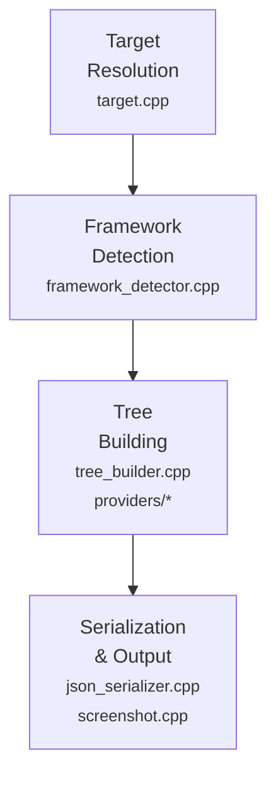
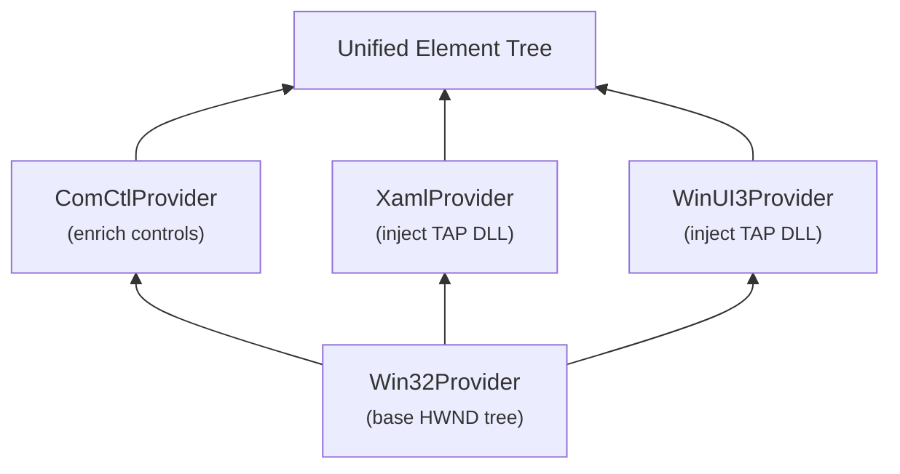

# Architecture

## Overview

lvt is structured as a 4-stage pipeline that transforms a target window identifier into a structured element tree.



## Stage 1: Target Resolution (`target.cpp`)

Accepts one of four target specifiers and resolves to an `HWND` + `PID`:

| Input | Resolution method |
|-------|-------------------|
| `--hwnd` | Used directly; PID via `GetWindowThreadProcessId` |
| `--pid` | `EnumWindows` → filter by PID → select largest visible window |
| `--name` | Enumerate all top-level windows, match process name (case-insensitive) |
| `--title` | Enumerate all top-level windows, match title substring |

For `--name` and `--title`, if multiple windows match, lvt prints all matches and exits (lets the user refine with `--hwnd`).

## Stage 2: Framework Detection (`framework_detector.cpp`)

Enumerates modules loaded in the target process via `EnumProcessModules` and checks for known DLLs:

| Framework | Detection signal | Version source |
|-----------|-----------------|----------------|
| Win32 | Always present | N/A |
| ComCtl | Child window with known ComCtl class name | `comctl32.dll` file version |
| XAML | `Windows.UI.Xaml.dll` loaded | DLL file version |
| WinUI3 | `Microsoft.UI.Xaml.dll` loaded | DLL file version |
| WPF | `PresentationFramework.dll` or `wpfgfx_*.dll` loaded | DLL file version |
| Avalonia | `Avalonia.Base.dll` loaded (via plugin) | DLL file version |

ComCtl detection uses `EnumChildWindows` and checks against a list of known class names (`SysListView32`, `SysTreeView32`, `ToolbarWindow32`, etc.).

## Stage 3: Tree Building (`tree_builder.cpp` + providers)

### Layered provider model

The tree is always rooted in the Win32 HWND hierarchy. Framework-specific providers layer additional detail on top:



1. **Win32Provider** builds the base tree by recursively enumerating child windows (`EnumChildWindows`). Each HWND becomes an `Element` with class name, text, bounds, styles.

2. **ComCtlProvider** walks the existing tree and enriches known ComCtl controls. For example, a `SysListView32` element gets child elements for its items, columns, and headers via control-specific messages (`LVM_GETITEMCOUNT`, `LVM_GETITEMTEXT`, etc.).

3. **XamlProvider / WinUI3Provider** inject the TAP DLL into the target process, receive the XAML visual tree as JSON via named pipe, and graft XAML subtrees into matching `DesktopChildSiteBridge` elements in the Win32 tree.

### Element ID assignment

After the full tree is built, `assign_element_ids()` walks the tree in depth-first order and assigns IDs: `e0`, `e1`, `e2`, …. These IDs are:
- Stable within a single invocation
- Deterministic (same tree structure → same IDs)
- Used by `--element` for subtree scoping and by screenshot annotations

### Bridge-to-XAML matching

WinUI 3 apps use `DesktopChildSiteBridge` windows to host XAML content inside Win32 HWNDs. The XAML provider:
1. Collects all bridge elements from the Win32 tree (in enumeration order)
2. Collects XAML root elements from the TAP DLL output (in order)
3. Matches them 1:1 by position
4. Grafts each XAML subtree as children of the corresponding bridge element

## Stage 4: Serialization (`json_serializer.cpp`, `screenshot.cpp`)

### JSON output

Standard JSON with `target` metadata, `frameworks` array, and `root` element tree. Uses nlohmann/json for serialization.

### XML output

XML markup where each element's type becomes the tag name. Attributes include `id`, `framework`, `className`, `text`, `bounds`, and any framework-specific properties.

### Screenshot capture

Uses `Windows.Graphics.Capture` APIs:
1. Create a `GraphicsCaptureItem` from the target HWND
2. Capture a frame via `Direct3D11CaptureFramePool`
3. Convert to a CPU-accessible bitmap
4. Annotate with bounding boxes and element ID labels using GDI
5. Fix alpha channel (GDI doesn't set alpha; must post-process to set all alpha bytes to 255)
6. Encode to PNG via `WICBitmapEncoder`

Annotation skips elements with zero bounds. XAML element bounds are computed from the bridge window's screen position plus per-element offsets and dimensions.

## Element model (`element.h`)

```cpp
struct Bounds {
    int x = 0, y = 0, width = 0, height = 0;
};

struct Element {
    std::string id;           // "e0", "e1", ...
    std::string type;         // Friendly name ("Button", "StackPanel")
    std::string framework;    // "win32", "comctl", "xaml", "winui3"
    std::string className;    // Full class/type name
    std::string text;         // Visible text or accessible name
    Bounds bounds;            // Screen coordinates
    std::map<std::string, std::string> properties;
    std::vector<Element> children;
    uintptr_t nativeHandle;   // Opaque handle (e.g. HWND)
};
```

## Dependencies

| Dependency | Purpose | Source |
|-----------|---------|--------|
| WIL | Smart pointers, error handling | vcpkg |
| nlohmann/json | JSON serialization | vcpkg |
| GoogleTest | Unit and integration tests | vcpkg |
| Windows SDK | Win32 APIs, XAML Diagnostics, Graphics.Capture | System |
| C++/WinRT | WinRT APIs (Graphics.Capture, BitmapEncoder) | Windows SDK |
