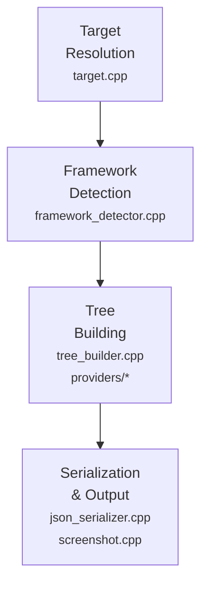
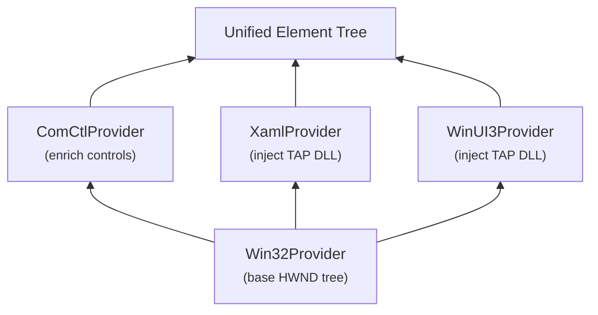
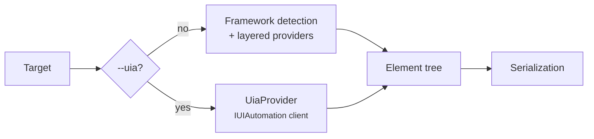

# Architecture

## Overview

lvt is structured as a 4-stage pipeline that transforms a target window identifier into a structured element tree.


```mermaid
flowchart TB
    A["Target\nResolution\n<small>target.cpp</small>"] --> B["Framework\nDetection\n<small>framework_detector.cpp</small>"]
    B --> C["Tree\nBuilding\n<small>tree_builder.cpp\nproviders/*</small>"]
    C --> D["Serialization\n& Output\n<small>json_serializer.cpp\nscreenshot.cpp</small>"]
```

## Stage 1: Target Resolution (`target.cpp`)

Accepts one of four target specifiers and resolves to an `HWND` + `PID`:

| Input | Resolution method |
|-------|-------------------|
| `--hwnd` | Used directly; PID via `GetWindowThreadProcessId` |
| `--pid` | `EnumWindows` → filter by PID → select largest visible window |
| `--name` | Enumerate all top-level windows, match process name (case-insensitive) |
| `--title` | Enumerate all top-level windows, match title substring |

For `--name` and `--title`, if multiple windows match, lvt prints all matches and exits (lets the user refine with `--hwnd`).

## Stage 2: Framework Detection (`framework_detector.cpp`)

Enumerates modules loaded in the target process via `EnumProcessModules` and checks for known DLLs:

| Framework | Detection signal | Version source |
|-----------|-----------------|----------------|
| Win32 | Always present | N/A |
| ComCtl | Child window with known ComCtl class name | `comctl32.dll` file version |
| XAML | `Windows.UI.Xaml.dll` loaded | DLL file version |
| WinUI3 | `Microsoft.UI.Xaml.dll` loaded | DLL file version |
| WPF | `PresentationFramework.dll` or `wpfgfx_*.dll` loaded | DLL file version |
| Avalonia | `Avalonia.Base.dll` loaded (via plugin) | DLL file version |

ComCtl detection uses `EnumChildWindows` and checks against a list of known class names (`SysListView32`, `SysTreeView32`, `ToolbarWindow32`, etc.).

## Stage 3: Tree Building (`tree_builder.cpp` + providers)

### Layered provider model

The tree is always rooted in the Win32 HWND hierarchy. Framework-specific providers layer additional detail on top:


```mermaid
flowchart BT
    Win32["Win32Provider\n<small>(base HWND tree)</small>"]
    ComCtl["ComCtlProvider\n<small>(enrich controls)</small>"]
    XAML["XamlProvider\n<small>(inject TAP DLL)</small>"]
    WinUI3["WinUI3Provider\n<small>(inject TAP DLL)</small>"]
    Tree["Unified Element Tree"]

    Win32 --> ComCtl & XAML & WinUI3
    ComCtl & XAML & WinUI3 --> Tree
```

1. **Win32Provider** builds the base tree by recursively enumerating child windows (`EnumChildWindows`). Each HWND becomes an `Element` with class name, text, bounds, styles.

2. **ComCtlProvider** walks the existing tree and enriches known ComCtl controls. For example, a `SysListView32` element gets child elements for its items, columns, and headers via control-specific messages (`LVM_GETITEMCOUNT`, `LVM_GETITEMTEXT`, etc.).

3. **XamlProvider / WinUI3Provider** inject the TAP DLL into the target process, receive the XAML visual tree as JSON via named pipe, and graft XAML subtrees into matching `DesktopChildSiteBridge` elements in the Win32 tree.

### Element ID assignment

After the full tree is built, `assign_element_ids()` walks the tree in depth-first order and assigns IDs: `e0`, `e1`, `e2`, …. These IDs are:
- Stable within a single invocation
- Deterministic (same tree structure → same IDs)
- Used by `--element` for subtree scoping and by screenshot annotations

### Bridge-to-XAML matching

WinUI 3 apps use `DesktopChildSiteBridge` windows to host XAML content inside Win32 HWNDs. The XAML provider:
1. Collects all bridge elements from the Win32 tree (in enumeration order)
2. Collects XAML root elements from the TAP DLL output (in order)
3. Matches them 1:1 by position
4. Grafts each XAML subtree as children of the corresponding bridge element

## Stage 3 (alternate): UI Automation tree (`providers/uia_provider.cpp`)

`--uia` swaps out Stage 3 entirely. Instead of the layered Win32-plus-providers
build, it walks the target's UI Automation tree with an `IUIAutomation` client
and returns the same `lvt::Element` type, so Stages 1 and 4 are untouched.


```mermaid
flowchart LR
    A["Target"] --> B{"--uia?"}
    B -- no --> C["Framework detection\n+ layered providers"]
    B -- yes --> D["UiaProvider\n<small>IUIAutomation client</small>"]
    C --> E["Element tree"]
    D --> E
    E --> F["Serialization"]
```

Differences that matter:

| | Visual tree | UIA tree |
|---|---|---|
| Mechanism | Native APIs + DLL injection | `IUIAutomation` client, no injection |
| Architecture | Must match the target | Cross-architecture |
| Identity | Class names, x:Name | `AutomationId`, `RuntimeId` |
| Actionability | none | `SupportedPatterns` + pattern state |

Three implementation constraints shape the provider:

1. **Everything goes through one cache request.** Each UIA property read is a
   cross-process call, so the provider builds an `IUIAutomationCacheRequest`
   with `TreeScope_Subtree` and every property and pattern it wants, calls
   `BuildUpdatedCache` once, then walks with `GetCachedChildren()` /
   `GetCachedPropertyValue()`. This is the difference between one round trip and
   thousands.

2. **Pattern-backed properties are read with the `Ex` accessor.** UIA's
   `GetCachedPropertyValue` substitutes the property type's *default* when an
   element does not support the owning pattern, so a `Window` answers
   `Toggle.ToggleState` with `2` (`ToggleState_Indeterminate`) exactly as a real
   checkbox answers `1`. Properties named `Pattern.Member` are therefore read
   with `GetCachedPropertyValueEx(id, ignoreDefaultValue=TRUE, …)`, whose
   reserved "not supported" return is the provider-authoritative signal — no
   property-to-pattern table needed. Core properties keep the plain accessor,
   because for them "not supported" also fires whenever a provider simply did
   not set the value, which would drop useful state such as `IsControlElement`.
   Separately, `uia_props.cpp` suppresses framework-specific "unset" sentinels
   (Win32 uses `0` where XAML uses `-1` for an unset `Level`).

3. **It runs on a dedicated MTA thread.** UIA clients want an MTA;
   `screenshot.cpp` initializes an STA on the calling thread. A thread cannot be
   both, so `run_on_mta()` marshals the walk onto its own thread, which also
   serializes access to the client.

The walk is bounded by `--uia-timeout`, which drives UIA's transaction timeout —
the thing that actually bounds a wedged target, since every cross-process call
happens inside the single `BuildUpdatedCache`. The per-element deadline check
additionally limits the in-process traversal of the materialised cache; when it
fires, the root carries a `Truncated` property so a consumer reading only the
document can tell the tree is incomplete.

It caps each provider response rather than total wall time, since one walk
involves many responses. The 10s default sits comfortably above a real app's
walk — the heaviest measured, a WebView2 host with ~380 elements, takes about
1.3s — while staying well under UIA's own 20s default.

## MCP server (`lvt_api.cpp` + `mcp/`)

`lvt mcp` serves the Model Context Protocol over stdio from inside `lvt.exe`.
It is not a fifth pipeline stage but a second front end: it drives the same
target resolution, tree building and action machinery the CLI does, only with a
session held open between requests instead of one process per command.

It is split across a language boundary:

```
mcp/src/server.rs     tool schemas, MCP protocol      (Rust, rmcp)
mcp/src/ffi.rs        the only unsafe code            (Rust)
        ↕  extern "C" — one function, JSON in, JSON out
src/lvt_api.cpp       sessions, dispatch, all logic   (C++)
src/providers/…       unchanged
```

**Why Rust.** `lvt mcp` has to be served by `lvt.exe` itself — a second binary
or a DLL would defeat the point of a single-executable release. That rules out
running the MCP SDK as a separate process, and of the options that link into an
existing MSVC binary, a Rust `staticlib` is the mainstream one. The alternative
considered, C# NativeAOT with `NativeLib=Static`, is documented by Microsoft as
implemented but unsupported.

**Why the seam is one function.** `lvt_api_call(method, params_json, &result)`
is the entire ABI. Adding a tool never changes it, the FFI surface is small
enough to audit at a glance, and if the Rust layer ever needed replacing the C++
side would not move.

**Memory ownership.** Rust always links the release CRT while lvt may be built
against the debug one, so the two can genuinely have different heaps. The rule
is therefore absolute: each side frees only what it allocated. `result_json` is
malloc'd by lvt and released only through `lvt_api_free`, which on the Rust side
is enforced by a `Drop` impl rather than by remembering to call it.

**Neither runtime unwinds into the other.** `lvt_api_call` wraps its body so no
C++ exception escapes; the Rust entry point uses `catch_unwind` and the crate is
built with `panic = "abort"`.

**stdout is the protocol.** Every diagnostic goes to stderr — this is why the
WIL logging callback was made stderr-only before any of this was written.

**Input gating** happens at registration, not at call time: `--allow-input`
selects which tool routers are composed, so a withheld tool is absent from
`tools/list` and not merely refused.

**Sessions** live in `lvt_api.cpp` behind a mutex, keyed `s1`, `s2`, …. Each
holds a resolved HWND, pid and architecture, so later calls skip target
resolution — which is ambiguous when several windows match a process name.

## Stage 4: Serialization (`json_serializer.cpp`, `screenshot.cpp`)
### JSON output

Standard JSON with `target` metadata, `frameworks` array, and `root` element tree. Uses nlohmann/json for serialization.

### XML output

XML markup where each element's type becomes the tag name. Attributes include `id`, `framework`, `className`, `text`, `bounds`, and any framework-specific properties.

### Screenshot capture

Uses `Windows.Graphics.Capture` APIs:
1. Create a `GraphicsCaptureItem` from the target HWND
2. Capture a frame via `Direct3D11CaptureFramePool`
3. Convert to a CPU-accessible bitmap
4. Annotate with bounding boxes and element ID labels using GDI
5. Fix alpha channel (GDI doesn't set alpha; must post-process to set all alpha bytes to 255)
6. Encode to PNG via `WICBitmapEncoder`

Annotation skips elements with zero bounds. XAML element bounds are computed from the bridge window's screen position plus per-element offsets and dimensions.

## Element model (`element.h`)

```cpp
struct Bounds {
    int x = 0, y = 0, width = 0, height = 0;
};

struct Element {
    std::string id;           // "e0", "e1", ...
    std::string type;         // Friendly name ("Button", "StackPanel")
    std::string framework;    // "win32", "comctl", "xaml", "winui3"
    std::string className;    // Full class/type name
    std::string text;         // Visible text or accessible name
    Bounds bounds;            // Screen coordinates
    std::map<std::string, std::string> properties;
    std::vector<Element> children;
    uintptr_t nativeHandle;   // Opaque handle (e.g. HWND)
};
```

## Dependencies

| Dependency | Purpose | Source |
|-----------|---------|--------|
| WIL | Smart pointers, error handling | vcpkg |
| nlohmann/json | JSON serialization | vcpkg |
| GoogleTest | Unit and integration tests | vcpkg |
| Windows SDK | Win32 APIs, XAML Diagnostics, Graphics.Capture | System |
| C++/WinRT | WinRT APIs (Graphics.Capture, BitmapEncoder) | Windows SDK |
