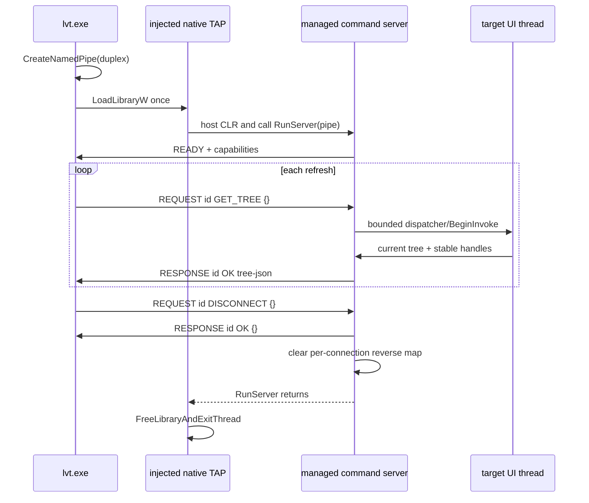

# Managed WPF and WinForms TAP connections

WPF and WinForms enrichment uses the same lifetime shape as the XAML providers: connect once for a watch or MCP session, read many trees, and disconnect once. A one-shot CLI command deliberately uses the same code path and releases the connection after its first tree.

## Components

- `providers/managed_connection.*` owns the native duplex pipe, command correlation, target-process liveness checks, serialization and clean disconnect.
- `tap_managed/managed_tap_host.*` is compiled into both architecture-specific native TAP DLLs. It finds the CLR already used by the target, loads the managed assembly once, and blocks in its command server until that server exits.
- `tap_wpf/WpfTreeWalker.cs` and `tap_winforms/WinFormsTreeWalker.cs` implement framework-specific tree walks and UI-thread dispatch.
- `WpfProvider` and `WinFormsProvider` expose `open_connection` and `enrich_with_connection`, matching the other `IFrameworkConnection` providers.

The native TAP names remain architecture-specific (`x86`, `x64`, `arm64`); the managed assemblies remain AnyCPU.

## Lifetime



The pipe also ends the command loop when lvt exits unexpectedly. Native reads and writes wait on both their overlapped-I/O event and the target process handle, so a target exit fails promptly instead of leaving a blocked thread. Before reconnecting, lvt verifies that the previous native TAP module has completed its safe worker-thread unload.

## Protocol

Messages are UTF-8, tab-delimited, and newline-terminated:

```text
READY  {"protocol":1,"connectionId":"…","assemblyInstanceId":"…","serverStartCount":1,"commands":["GET_TREE","DISCONNECT"]}
REQUEST  1  GET_TREE  {}
RESPONSE 1  OK  [{...}]
REQUEST  2  DISCONNECT {}
RESPONSE 2  OK  {}
```

Tabs above represent literal tab characters. Request IDs make responses unambiguous even as new commands are added. The final JSON argument slot and the advertised command list are extension points for later managed property operations; this layer intentionally does not define the shared property descriptor contract.

## Identity and object lifetime

Each managed assembly assigns controls/objects IDs through a `ConditionalWeakTable`. The table does not keep controls alive. Every connection maintains a reverse weak map containing only objects visited by the latest successful tree snapshot; it replaces that map on refresh and clears it on disconnect.

- WPF emits a managed handle for every visual or logical `DependencyObject`.
- WinForms emits both the managed handle and an HWND when the control already owns one. Reading the tree never creates a handle merely to obtain identity.
- Native `Element::nativeHandle`, `properties.managedHandle`, and compact durable keys preserve this identity across refreshes. WinForms keeps the HWND as `nativeHandle` when one exists and retains the managed handle alongside it for future command routing.

## UI-thread rules

The pipe thread never reads framework objects directly.

- WPF queues the complete walk with `Application.Dispatcher.InvokeAsync` and applies a finite timeout.
- WinForms finds an existing top-level control and queues the complete walk with `BeginInvoke`; there is no direct off-thread fallback.

A timeout returns a correlated command error while leaving the transport available for a later retry. Broken transport or target exit marks the native connection dead so the registry can replace it.
