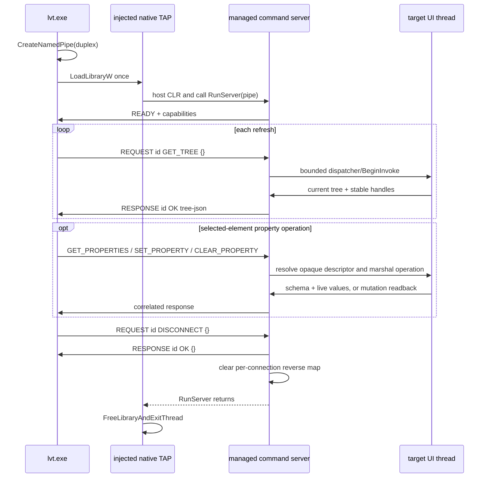

# Managed WPF and WinForms TAP connections

WPF and WinForms enrichment uses the same lifetime shape as the XAML providers: connect once for a watch or MCP session, read many trees, and disconnect once. A one-shot CLI command deliberately uses the same code path and releases the connection after its first tree.

## Components

- `providers/managed_connection.*` owns the native duplex pipe, command correlation, target-process liveness checks, serialization and clean disconnect.
- `tap_managed/managed_tap_host.*` is compiled into both architecture-specific native TAP DLLs. It finds the CLR already used by the target, loads the managed assembly once, and blocks in its command server until that server exits.
- `tap_wpf/WpfTreeWalker.cs` and `tap_winforms/WinFormsTreeWalker.cs` implement framework-specific tree walks and UI-thread dispatch.
- `WpfProvider` and `WinFormsProvider` expose `open_connection` and `enrich_with_connection`, matching the other `IFrameworkConnection` providers.

The native TAP names remain architecture-specific (`x86`, `x64`, `arm64`); the managed assemblies remain AnyCPU.

## Lifetime



The pipe also ends the command loop when lvt exits unexpectedly. Native reads and writes wait on both their overlapped-I/O event and the target process handle, so a target exit fails promptly instead of leaving a blocked thread. Before reconnecting, lvt verifies that the previous native TAP module has completed its safe worker-thread unload.

Connection bootstrap is serialized across lvt processes by a named mutex keyed
by target PID and framework. The mutex covers module inspection, sidecar
creation, `LoadLibraryW`, pipe acceptance, and the `READY` handshake, preventing
simultaneous injectors from adding an unmatched module reference. Sidecar,
mutex, and pipe ACLs are restricted to SYSTEM plus the current/target user.
After every pipe connection, lvt verifies `GetNamedPipeClientProcessId` against
the intended target PID before reading `READY`; mismatched clients are
disconnected and the server resumes waiting.

## Protocol

Messages are UTF-8, tab-delimited, and newline-terminated:

```text
READY  {"protocol":1,"connectionId":"…","assemblyInstanceId":"…","serverStartCount":1,"commands":["GET_TREE","GET_PROPERTIES","SET_PROPERTY","CLEAR_PROPERTY","DISCONNECT"]}
REQUEST  1  GET_TREE  {}
RESPONSE 1  OK  [{...}]
REQUEST  2  GET_PROPERTIES  42
RESPONSE 2  OK  {"schemaId":"…","descriptors":[...],"values":[...]}
REQUEST  3  SET_PROPERTY  42 descriptor-id-as-utf8-hex value-as-utf8-hex
RESPONSE 3  OK  {"value":"read back from target"}
REQUEST  4  DISCONNECT {}
RESPONSE 4  OK  {}
```

Tabs above represent literal tab characters. Request IDs make responses unambiguous. Descriptor IDs and values use UTF-8 hexadecimal tokens, so whitespace and newlines cannot change framing. The managed server validates connection-scoped opaque descriptor IDs; callers never provide a CLR property name or type.

## Identity and object lifetime

Each managed assembly assigns controls/objects IDs through a `ConditionalWeakTable`. The table does not keep controls alive. Every connection maintains a reverse weak map containing only objects visited by the latest successful tree snapshot; it replaces that map on refresh and clears it on disconnect.

- WPF emits a managed handle for every visual or logical `DependencyObject`.
- WinForms emits both the managed handle and an HWND when the control already owns one. Reading the tree never creates a handle merely to obtain identity.
- Native `Element::providerHandle`, `properties.managedHandle`, and compact durable keys preserve managed identity across refreshes. WinForms keeps any existing HWND separately as `nativeHandle`; property routing always uses the 64-bit provider handle.

## Typed property policies

Schemas are connection-scoped, immutable metadata. Live values are returned separately on every `GET_PROPERTIES`; reconnecting creates a new descriptor namespace and invalidates old IDs.

### WPF

WPF enumerates `DependencyPropertyDescriptor` metadata for the target's runtime `Type` and caches it without retaining target objects. Only writable dependency properties with conservative scalar types are exposed. Ordinary CLR properties and object graphs are excluded. Editor kinds come from the dependency property's declared `PropertyType`; enum choices come from `Enum.GetValues`.

Reads use `GetValue`. Mutations use `SetValue` and `ClearValue` on the application dispatcher and return a fresh readback. `ReadLocalValue` determines `overridden` and `canClear`; clearing removes the local value so style, inheritance, or default precedence resumes.

### WinForms

WinForms uses `TypeDescriptor.GetProperties(control)`, including custom type-description providers. The schema cache key combines runtime type, provider/type-descriptor identity, and a descriptor metadata signature. Cached entries contain no controls.

Only browsable, readable/writable, non-indexed properties are considered. The allowlist is string, Boolean, character, numeric primitive/decimal, enum, and nullable forms, with exact built-in converter types audited before inclusion. Controls, object graphs, collections, delegates, images, fonts, and arbitrary converters are excluded.

Reads and writes use the current `PropertyDescriptor`. Clear is advertised only for descriptors with reset metadata, is enabled live only when `CanResetValue` succeeds, and executes `ResetValue`. Set and reset responses contain the value read back from the target.

## UI-thread rules

The pipe thread never reads framework objects directly.

- WPF queues tree and property work with `Application.Dispatcher.InvokeAsync` and applies a finite timeout.
- WinForms records each control's owning top-level control/Form during the tree walk and queues property work through that owner's `BeginInvoke`; there is no direct off-thread fallback.

A timeout returns a correlated command error while leaving the transport available for a later retry. Broken transport or target exit marks the native connection dead so the registry can replace it.

If a WPF or WinForms `GET_TREE` fails after native HWND labeling, the provider
marks the result as an incomplete framework refresh. Watch retries and retains
its previous snapshot rather than emitting false subtree removals. MCP visual
reads and resources likewise retry and refuse to advance their baseline to the
host-only tree.
