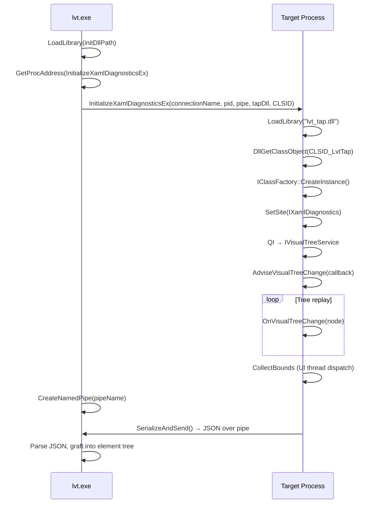

# TAP DLL Design

## Overview

The TAP DLL (`lvt_tap.dll`) is a COM in-process server that gets injected into the target process to walk XAML visual trees. It uses the same diagnostic infrastructure that Visual Studio's Live Visual Tree uses. ("TAP" comes from the `wszTAPDllName` parameter of `InitializeXamlDiagnosticsEx`.)

## Injection flow



### Connection names

The XAML diagnostics API uses named connections. Each concurrent diagnostics session needs a unique name:
- **System XAML (UWP):** `"VisualDiagConnection1"`, `"VisualDiagConnection2"`, …
- **WinUI 3:** `"WinUIVisualDiagConnection1"`, `"WinUIVisualDiagConnection2"`, …

lvt tries connection names sequentially until one succeeds (doesn't return `ERROR_NOT_FOUND`).

### Init DLL paths

| Framework | `initDllPath` | `xamlDiagDll` |
|-----------|---------------|---------------|
| System XAML | `"Windows.UI.Xaml.dll"` | Same |
| WinUI 3 | Full path to `FrameworkUdk.dll` in the app's WinUI package | Full path to `Microsoft.UI.Xaml.dll` |

## COM class structure

```
LvtTap : IObjectWithSite, IVisualTreeServiceCallback2
  │
  ├── SetSite(IXamlDiagnostics*)
  │     ├── QI → IVisualTreeService (m_vts)
  │     ├── Create message-only window (m_msgWnd)
  │     └── Launch worker thread (AdviseThreadProc)
  │
  ├── OnVisualTreeChange(relation, element, mutation)
  │     └── Build TreeNode map (m_nodes, m_roots)
  │
  └── Worker thread:
        ├── AdviseVisualTreeChange(callback)  [replays existing tree]
        ├── SendMessage(WM_COLLECT_BOUNDS)    [dispatch to UI thread]
        ├── SerializeAndSend()                [JSON → named pipe]
        └── UnadviseVisualTreeChange()
```

## Threading model

This is the most critical aspect of the TAP DLL design.

### The problem

`SetSite()` is called on the XAML UI thread. Two key constraints:
1. `AdviseVisualTreeChange` **blocks** if called on the `SetSite` thread — must use a worker thread
2. `GetPropertyValuesChain` has **strict thread affinity** — must run on the UI thread

These constraints are contradictory: the tree replay (via `AdviseVisualTreeChange`) must happen on a worker thread, but property queries must happen on the UI thread.

### The solution: message-only window dispatch

```
UI Thread                          Worker Thread
─────────                          ─────────────
SetSite() called
  ├─ Create message window
  ├─ Launch worker thread ──────→  AdviseVisualTreeChange()
  └─ Return S_OK                     ├─ OnVisualTreeChange × N
     (UI thread is now free)          │   (builds m_nodes map)
                                      │
                                      ├─ SendMessage(WM_COLLECT_BOUNDS)
     ┌────────────────────────────────┘   (blocks worker thread)
     │
  WndProc: WM_COLLECT_BOUNDS
     ├─ CollectBoundsOnUIThread()
     │   └─ For each node:
     │       GetPropertyValuesChain()
     │       → extract ActualWidth, ActualHeight, ActualOffset
     └─ Return ──────────────────→  SerializeAndSend()
                                      └─ Write JSON to pipe
```

Key details:
- The message-only window is created on the UI thread in `SetSite()` via `CreateWindowExW(... HWND_MESSAGE ...)`
- `SendMessage` from the worker thread blocks until the UI thread processes `WM_COLLECT_BOUNDS`
- The UI thread is free at this point (SetSite has returned), so there's no deadlock
- SEH wrappers (`CollectBoundsForNodeSEH`) protect against crashes in individual node queries

### Why COM marshaling doesn't work

We tried `CoMarshalInterThreadInterfaceInStream` + `CoGetInterfaceAndReleaseStream` to marshal `IVisualTreeService` to the worker thread. This correctly handles COM apartment threading, but `GetPropertyValuesChain` still returns `RPC_E_WRONG_THREAD` (0x8001010E). The XAML runtime has internal thread affinity checks beyond COM's apartment model.

## Tree node data

Each `TreeNode` stores:

| Field | Source | Description |
|-------|--------|-------------|
| `handle` | `OnVisualTreeChange` | XAML runtime instance handle |
| `type` | `VisualElement.Type` | Full type name (e.g. `"Microsoft.UI.Xaml.Controls.Button"`) |
| `name` | `VisualElement.Name` | `x:Name` value if set |
| `parent` | `ParentChildRelation` | Parent handle (0 for roots) |
| `childHandles` | Accumulated from child events | Ordered child list |
| `width`, `height` | `GetPropertyValuesChain` | `ActualWidth` and `ActualHeight` |
| `offsetX`, `offsetY` | `GetPropertyValuesChain` | `ActualOffset` (if available) |
| `hasBounds` | Computed | `true` if both width and height were collected |

### Bounds collection results

Not all nodes return bounds:
- ~55% of XAML nodes get `ActualWidth`/`ActualHeight` (non-UIElement roots like `Application` don't have these properties)
- `ActualOffset` is often not available via `GetPropertyValuesChain` (it's a non-dependency-property in WinUI 3)
- When offsets are missing, all XAML elements within a bridge share the bridge window's screen position

## JSON output format

The TAP DLL serializes the tree as a JSON array of root nodes:

```json
[
  {
    "type": "Microsoft.UI.Xaml.Controls.ContentPresenter",
    "name": "",
    "handle": 12345,
    "width": 800.0,
    "height": 600.0,
    "offsetX": 0.0,
    "offsetY": 0.0,
    "children": [...]
  }
]
```

This is sent as UTF-8 over the named pipe and parsed by `graft_json_node()` in `xaml_diag_common.cpp`.

## Static CRT

The TAP DLL is built with `/MT` (static CRT). This is essential because:
- The DLL is injected into arbitrary processes
- The target process may use a different CRT version
- Dynamic CRT linking (`/MD`) would require the target to have the matching `vcruntime*.dll`

## Debugging

- **Log file:** `%TEMP%\lvt_tap.log` — all TAP DLL operations are logged with thread IDs
- **Debugger:** Use `C:\Debuggers\cdb.exe` to attach to the target process and debug injection issues
- **File lock:** `lvt_tap.dll` is locked by the target process after injection. Kill the target before rebuilding.
