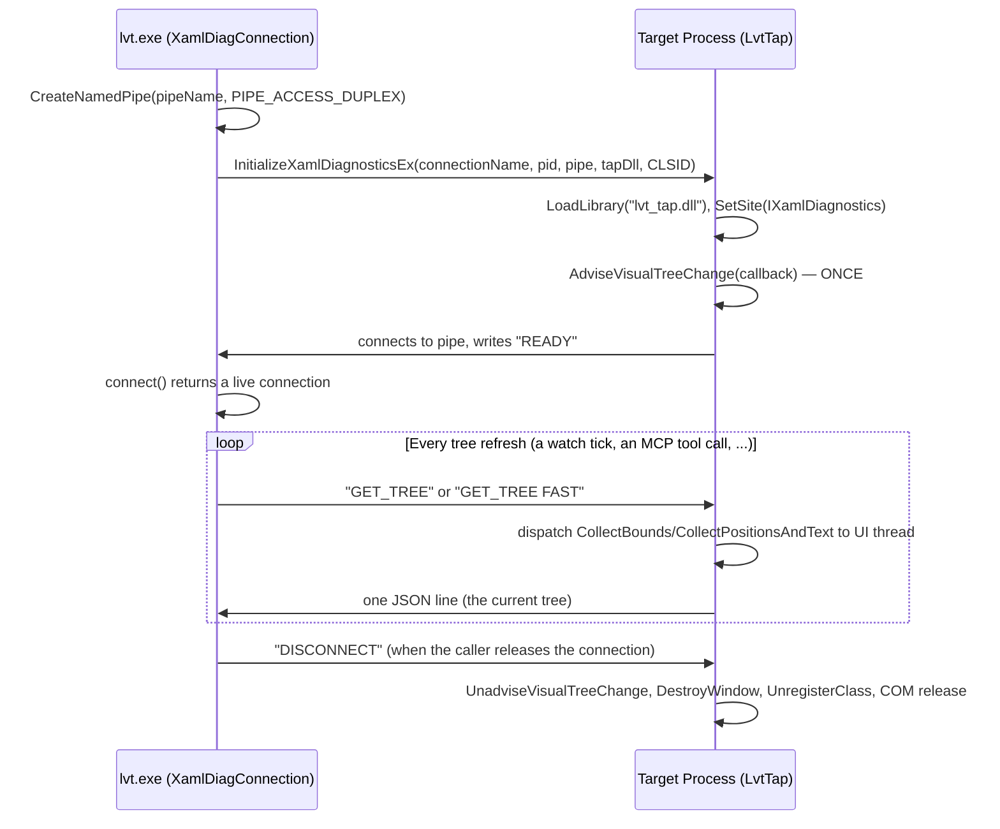
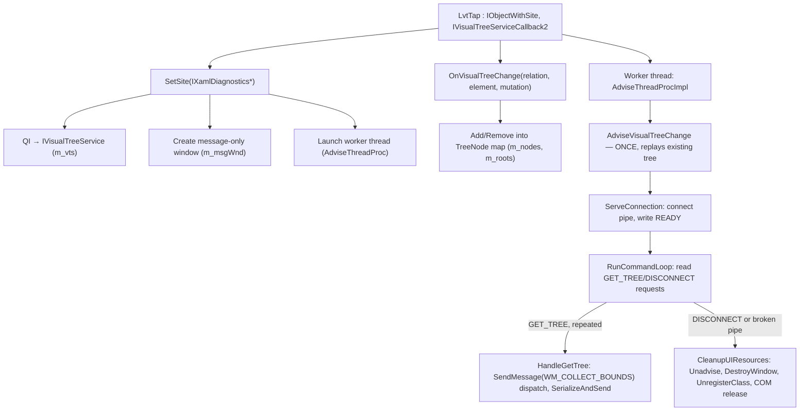
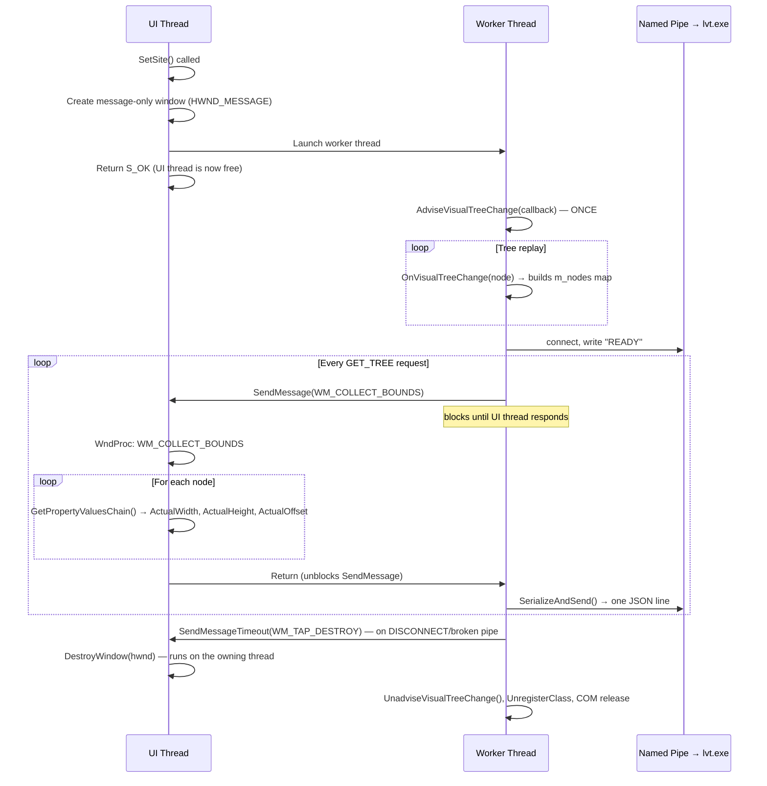

# TAP DLL Design

## Overview

The TAP DLL (`lvt_tap.dll`) is a COM in-process server that gets injected into the target process to walk XAML visual trees. It uses the same diagnostic infrastructure that Visual Studio's Live Visual Tree uses. ("TAP" comes from the `wszTAPDllName` parameter of `InitializeXamlDiagnosticsEx`.)

`InitializeXamlDiagnosticsEx` and `AdviseVisualTreeChange` are a subscribe-and-react API: they are meant to be called **once** per debugging session, with `OnVisualTreeChange` then incrementally reporting Add/Remove mutations for as long as the subscription stays alive. The TAP DLL is built around that model — connect once, serve many tree refreshes over a persistent pipe, disconnect once when the session ends — not around reconnecting from scratch on every refresh. An earlier version of this file did the latter (calling `InitializeXamlDiagnosticsEx` fresh every `watch` tick); that caused a confirmed, unbounded resource leak (one message-only window created and never destroyed per tick) and was the root cause of a "tree refreshes/resets" bug reported against Microsoft Store. See `src/providers/framework_connection.h` and `connection_registry.h` for the caller-side half of this design.

## Connection lifecycle


```mermaid
sequenceDiagram
    participant lvt as lvt.exe (XamlDiagConnection)
    participant target as Target Process (LvtTap)

    lvt->>lvt: CreateNamedPipe(pipeName, PIPE_ACCESS_DUPLEX)
    lvt->>target: InitializeXamlDiagnosticsEx(connectionName, pid, pipe, tapDll, CLSID)
    target->>target: LoadLibrary("lvt_tap.dll"), SetSite(IXamlDiagnostics)
    target->>target: AdviseVisualTreeChange(callback) — ONCE
    target->>lvt: connects to pipe, writes "READY"
    lvt->>lvt: connect() returns a live connection

    loop Every tree refresh (a watch tick, an MCP tool call, ...)
        lvt->>target: "GET_TREE" or "GET_TREE FAST"
        target->>target: dispatch CollectBounds/CollectPositionsAndText to UI thread
        target->>lvt: one JSON line (the current tree)
    end

    lvt->>target: "DISCONNECT" (when the caller releases the connection)
    target->>target: UnadviseVisualTreeChange, DestroyWindow, UnregisterClass, COM release
```

### Connection names

The XAML diagnostics API uses named connections. Each concurrent diagnostics session needs a unique name:
- **System XAML (UWP):** `"VisualDiagConnection1"`, `"VisualDiagConnection2"`, …
- **WinUI 3:** `"WinUIVisualDiagConnection1"`, `"WinUIVisualDiagConnection2"`, …

lvt tries connection names sequentially until one succeeds (doesn't return
`ERROR_NOT_FOUND`). Identifiers are monotonically allocated by a XAML core and
can grow well beyond 10 in long-lived, multi-window apps, so lvt scans up to
10,000 names (matching UWPSpy's strategy) rather than assuming a small fixed
range.

### Init DLL paths

| Framework | `initDllPath` | `xamlDiagDll` |
|-----------|---------------|---------------|
| System XAML | `"Windows.UI.Xaml.dll"` | Same |
| WinUI 3 | Full path to `FrameworkUdk.dll` in the app's WinUI package | Full path to `Microsoft.UI.Xaml.dll` |

## COM class structure


```mermaid
flowchart TB
    LvtTap["LvtTap : IObjectWithSite, IVisualTreeServiceCallback2"]

    SetSite["SetSite(IXamlDiagnostics*)"]
    QI["QI → IVisualTreeService (m_vts)"]
    MsgWnd["Create message-only window (m_msgWnd)"]
    Launch["Launch worker thread (AdviseThreadProc)"]

    OnVTC["OnVisualTreeChange(relation, element, mutation)"]
    BuildMap["Add/Remove into TreeNode map (m_nodes, m_roots)"]

    WorkerThread["Worker thread: AdviseThreadProcImpl"]
    Advise["AdviseVisualTreeChange — ONCE, replays existing tree"]
    Serve["ServeConnection: connect pipe, write READY"]
    Loop["RunCommandLoop: read GET_TREE/DISCONNECT requests"]
    HandleGetTree["HandleGetTree: SendMessage(WM_COLLECT_BOUNDS) dispatch, SerializeAndSend"]
    Cleanup["CleanupUIResources: Unadvise, DestroyWindow, UnregisterClass, COM release"]

    LvtTap --> SetSite & OnVTC & WorkerThread
    SetSite --> QI & MsgWnd & Launch
    OnVTC --> BuildMap
    WorkerThread --> Advise --> Serve --> Loop
    Loop -->|GET_TREE, repeated| HandleGetTree
    Loop -->|DISCONNECT or broken pipe| Cleanup
```

## Threading model

This is the most critical aspect of the TAP DLL design.

### The problem

`SetSite()` is called on the XAML UI thread. Two key constraints:
1. `AdviseVisualTreeChange` **blocks** if called on the `SetSite` thread — must use a worker thread
2. `GetPropertyValuesChain` has **strict thread affinity** — must run on the UI thread

These constraints are contradictory: the tree replay (via `AdviseVisualTreeChange`) must happen on a worker thread, but property queries must happen on the UI thread.

### The solution: message-only window dispatch


```mermaid
sequenceDiagram
    participant UI as UI Thread
    participant Worker as Worker Thread
    participant Pipe as Named Pipe → lvt.exe

    UI->>UI: SetSite() called
    UI->>UI: Create message-only window (HWND_MESSAGE)
    UI->>Worker: Launch worker thread
    UI->>UI: Return S_OK (UI thread is now free)

    Worker->>Worker: AdviseVisualTreeChange(callback) — ONCE
    loop Tree replay
        Worker->>Worker: OnVisualTreeChange(node) → builds m_nodes map
    end
    Worker->>Pipe: connect, write "READY"

    loop Every GET_TREE request
        Worker->>UI: SendMessage(WM_COLLECT_BOUNDS)
        Note over Worker: blocks until UI thread responds
        UI->>UI: WndProc: WM_COLLECT_BOUNDS
        loop For each node
            UI->>UI: GetPropertyValuesChain() → ActualWidth, ActualHeight, ActualOffset
        end
        UI->>Worker: Return (unblocks SendMessage)
        Worker->>Pipe: SerializeAndSend() → one JSON line
    end

    Worker->>UI: SendMessageTimeout(WM_TAP_DESTROY) — on DISCONNECT/broken pipe
    UI->>UI: DestroyWindow(hwnd) — runs on the owning thread
    Worker->>Worker: UnadviseVisualTreeChange(), UnregisterClass, COM release
```

Key details:
- The message-only window is created **once**, on the UI thread in `SetSite()`, via `CreateWindowExW(... HWND_MESSAGE ...)` — and destroyed exactly once, when the connection ends, not per request.
- `SendMessage` from the worker thread blocks until the UI thread processes `WM_COLLECT_BOUNDS`
- The UI thread is free at this point (SetSite has returned), so there's no deadlock
- `DestroyWindow` must run on the thread that created the window; the worker thread cannot call it directly, so cleanup dispatches `WM_TAP_DESTROY` to the UI thread via `SendMessageTimeoutW` (bounded, so a hung/gone UI thread cannot block cleanup forever)
- SEH wrappers (`CollectBoundsForNodeSEH`) protect against crashes in individual node queries
- `m_nodes`/`m_roots`/`m_orderedHandles` are guarded by `m_nodesMutex`: once a connection stays open across many requests, `OnVisualTreeChange` can fire (adding or removing nodes) between — or even during — a `GET_TREE` request's own collection pass, which the old one-shot-per-tick design never had to account for

### Why COM marshaling doesn't work

We tried `CoMarshalInterThreadInterfaceInStream` + `CoGetInterfaceAndReleaseStream` to marshal `IVisualTreeService` to the worker thread. This correctly handles COM apartment threading, but `GetPropertyValuesChain` still returns `RPC_E_WRONG_THREAD` (0x8001010E). The XAML runtime has internal thread affinity checks beyond COM's apartment model.

## Tree node data

Each `TreeNode` stores:

| Field | Source | Description |
|-------|--------|-------------|
| `handle` | `OnVisualTreeChange` | XAML runtime instance handle |
| `type` | `VisualElement.Type` | Full type name (e.g. `"Microsoft.UI.Xaml.Controls.Button"`) |
| `name` | `VisualElement.Name` | `x:Name` value if set |
| `parent` | `ParentChildRelation` | Parent handle (0 for roots) |
| `childHandles` | Accumulated from child events | Ordered child list |
| `width`, `height` | `GetPropertyValuesChain` | `ActualWidth` and `ActualHeight` |
| `offsetX`, `offsetY` | `GetPropertyValuesChain` | `ActualOffset` (if available) |
| `hasBounds` | Computed | `true` if both width and height were collected |

`OnVisualTreeChange` handles both `Add` (inserts into `m_nodes`/the parent's `childHandles`, or `m_roots` for a top-level element) and `Remove` (erases from all three) — Remove handling only matters once a connection's tree state persists across many requests instead of being torn down and rebuilt from scratch every time.

### Bounds collection results

Not all nodes return bounds:
- ~55% of XAML nodes get `ActualWidth`/`ActualHeight` (non-UIElement roots like `Application` don't have these properties)
- `ActualOffset` is often not available via `GetPropertyValuesChain` (it's a non-dependency-property in WinUI 3)
- When offsets are missing, all XAML elements within a bridge share the bridge window's screen position

## Wire protocol

Every message on the pipe is one line (UTF-8, `\n`-terminated). lvt.exe → TAP DLL commands are plain text; TAP DLL → lvt.exe responses are either a literal `READY`/`BYE`, or the tree itself as a JSON array of root nodes:

```json
[
  {
    "type": "Microsoft.UI.Xaml.Controls.ContentPresenter",
    "name": "",
    "handle": 12345,
    "width": 800.0,
    "height": 600.0,
    "offsetX": 0.0,
    "offsetY": 0.0,
    "children": [...]
  }
]
```

| Direction | Message | Meaning |
|-----------|---------|---------|
| TAP → lvt | `READY` | Sent once, right after `AdviseVisualTreeChange` succeeds — before any bounds/property collection |
| lvt → TAP | `GET_TREE` / `GET_TREE FAST` | Request a refresh; `FAST` overrides the connection's default fast-mode setting for this one response |
| TAP → lvt | `[...]` | One JSON array of root nodes, in response to `GET_TREE` |
| lvt → TAP | `DISCONNECT` | End the connection; TAP DLL replies `BYE`, then runs its cleanup |

Parsed and grafted by `graft_xaml_tree_json()` in `xaml_diag_common.cpp`.

## Static CRT

The TAP DLL is built with `/MT` (static CRT). This is essential because:
- The DLL is injected into arbitrary processes
- The target process may use a different CRT version
- Dynamic CRT linking (`/MD`) would require the target to have the matching `vcruntime*.dll`

## Debugging

- **Log file:** `%TEMP%\lvt_tap.log` for unpackaged targets, but `%LOCALAPPDATA%\Packages\<PackageFamilyName>\AC\Temp\lvt_tap.log` for AppContainer (UWP/MSIX-packaged) targets — the two are easy to confuse when debugging a packaged app. All TAP DLL operations are logged with millisecond timestamps and thread IDs. Because the TAP DLL never unloads (`DllCanUnloadNow` returns `S_FALSE`, see below), this file accumulates across every run against that target for as long as the target process lives, not just the most recent one.
- **Debugger:** Use `C:\Debuggers\cdb.exe` to attach to the target process and debug injection issues
- **File lock:** `lvt_tap.dll` is locked by the target process after injection. Kill the target before rebuilding. For AppContainer targets, the staged copy at `%TEMP%\lvt_tap\` can also be held open by an unrelated, long-lived AppContainer host process from an earlier test run — if a rebuilt DLL isn't taking effect, check for and kill stale processes still holding that staged file before assuming the build itself is broken.
